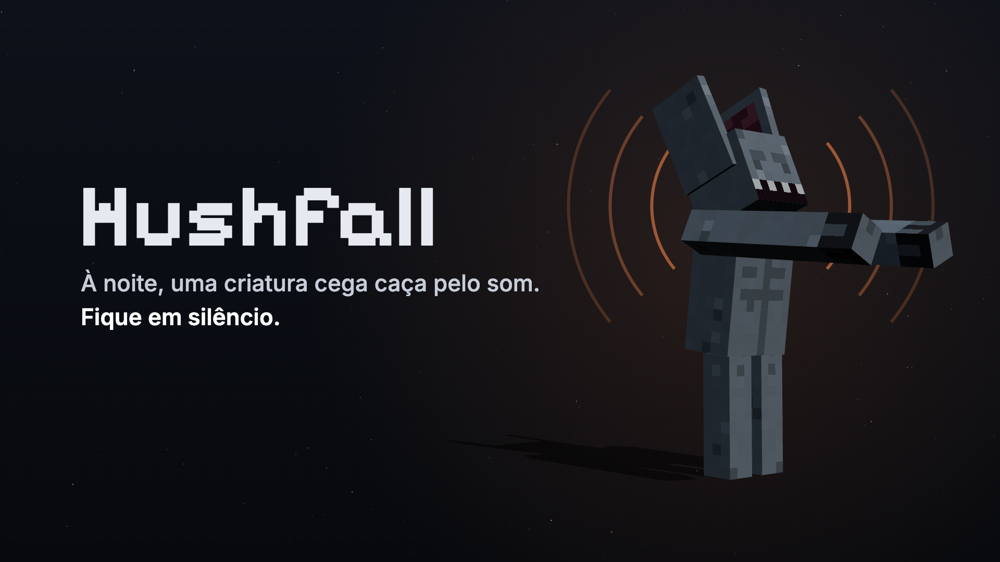
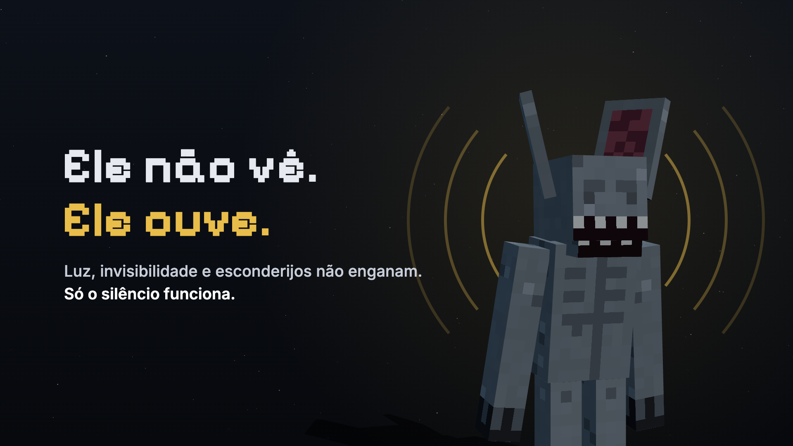
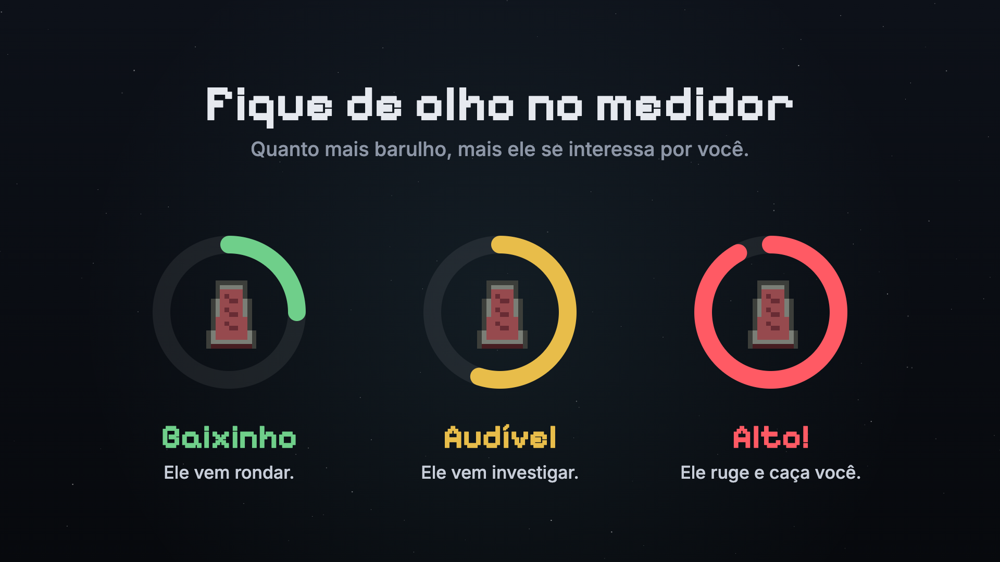
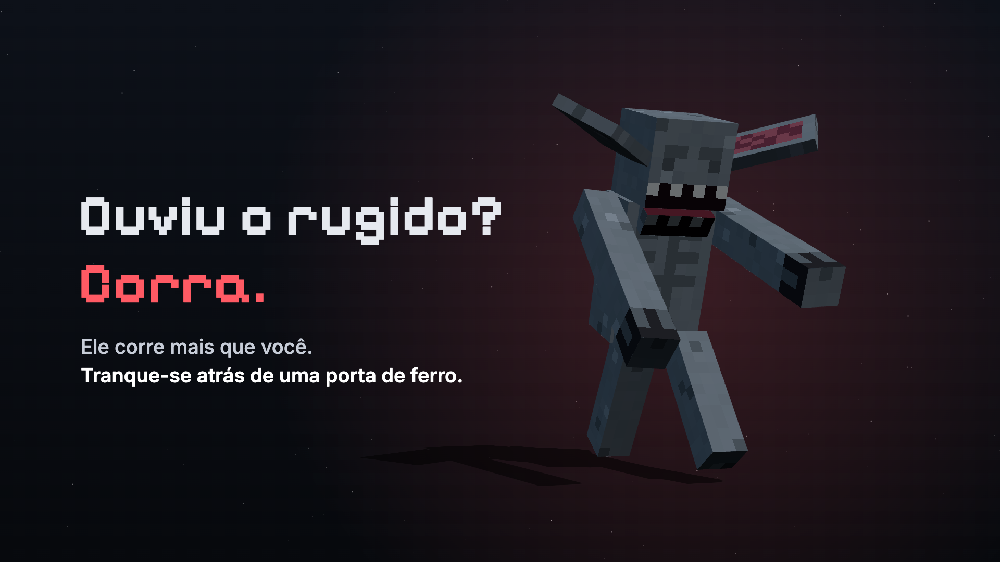
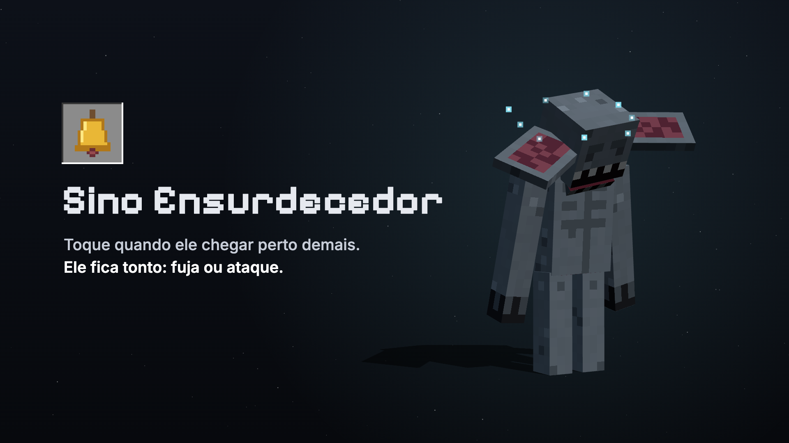
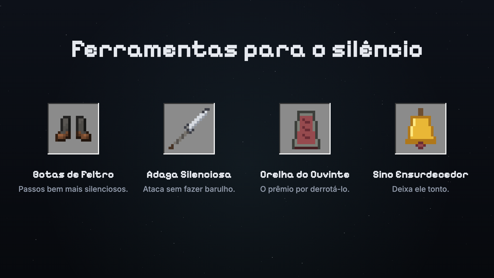

# Hushfall (Silêncio Total)



**Site:** [hushfall-minecraft.vercel.app](https://hushfall-minecraft.vercel.app/) · **Download:** [última versão](https://github.com/pedrorreiro/hushfall/releases/latest)

*Hush* (silêncio) + *nightfall* (anoitecer): quando a noite cai, faça silêncio.

Mod Fabric para Minecraft **26.3** (Java 25), feito a partir do template oficial `fabric-example-mod`.

À noite, o mundo é governado pelo **Ouvinte**, uma criatura cega que caça só pelo som. De dia você constrói em paz; de noite, joga em silêncio e usa o barulho como ferramenta.

As regras completas estão em [REGRAS.md](REGRAS.md).

## Resumo

- **Metade das noites**: a primeira noite é de graça e depois cada noite tem 50% de chance de ter o Ouvinte. Uma mensagem ao anoitecer avisa.
- **Medidor de ruído (0–100)** redondo no canto da tela, só nas noites em que ele vem. Andar +5/s (teto 70), correr +10/s, pular +6, bater num bloco +2 a +5/s, quebrar bloco +5/+10/+15, abrir baú/porta +8, combate +15, explosão +40, barco +3/s, carrinho de mina +8/s. Parado ou agachado cai 4/s. Canto, margem e tamanho do medidor mudam pelo Mod Menu (opcional) ou em `config/silenciototal-client.json`.
- **Faixas**: 1–30 ele só ouve de perto e vem rondar; 31–70 ele ouve de qualquer distância e vem investigar; 71+ ele ruge e caça. Longe demais, ele se enterra e ressurge perto de quem fez barulho.
- **Modificadores**: lã/tapete/neve/água -50%, cascalho/vidro +50%, Botas de Feltro -60%, chuva -30%, trovoada -50%.
- **Distrações**: sino, note block, pistão, dispensador, projéteis, explosões e raios. Cooldown por bloco, e ele se habitua a lugares onde já procurou à toa (a memória fica salva no mundo).
- **Sair do mundo**: a barra fica salva com o jogador. Quem sai no meio de uma caçada volta com barulho alto e ele caça de novo.
- **Casas**: em silêncio dentro de casa ele não entra. Fazendo barulho, ele arromba portas de madeira; porta de ferro aguenta.
- **Dormir**: em silêncio, com ele só patrulhando, a cama funciona. Ele só impede o sono quando está caçando, alerta, desconfiado ou farejando você.
- **Combate**: ele não regenera. Todo dano fica, inclusive de uma noite para a outra, até ele morrer.
- **Ouvinte**: um só por mundo, chefe com 75 corações e barra de vida. 3 blocos de altura (se espreme em túneis). Surge ao anoitecer a 32–45 blocos (nunca a menos de 30) e vai rondando a sua área, sempre avisa antes de atacar e se enterra ao amanhecer. A 8 blocos ele te descobre se sua barra estiver em 10+; em silêncio ele só fareja e não ataca. Perto do limite ele desconfia (vira a cabeça, orelhas em pé) e você ouve o próprio coração com as bordas da tela escurecendo. Morto, volta na noite seguinte e dropa a **Orelha do Ouvinte**, ingrediente do **Sino Ensurdecedor** (atordoa o Ouvinte por 10 s, uma vez por noite).

## Galeria

| | |
|---|---|
|  |  |
|  |  |
|  | |

Ícone, imagens e descrições para publicar no Modrinth e no CurseForge ficam em [`branding/`](branding/): [`icone.png`](branding/icone.png), [`galeria/`](branding/galeria/), [`descricao.md`](branding/descricao.md) (Markdown, inglês e português) e [`descricao-curseforge.html`](branding/descricao-curseforge.html) (HTML para o editor do CurseForge).

## Ver os modelos sem abrir o jogo

Abra [tools/visualizador.html](tools/visualizador.html) no navegador (ou o site publicado, gerado em `site/index.html`): o Ouvinte em 3D com os 4 estados de animação e os sons de cada um, os itens com as receitas no estilo da wiki e o guia de como jogar. Depois de mudar texturas, rode:

```bash
python3 tools/build_viewer.py
```

## Desenvolvimento

Precisa de JDK 25.

```bash
./gradlew build              # gera build/libs/silenciototal-<versão>.jar
./gradlew runClient          # abre o jogo com o mod
./gradlew runClientGameTest  # teste automatizado: anoitece, mede ruído, testa Ouvinte, distrações, portas, sino e amanhecer
```

Para instalar, coloque o jar em `mods/` junto com o Fabric API (0.161.0+26.3) e o Fabric Loader 0.19.5 ou superior. O [Mod Menu](https://modrinth.com/mod/modmenu) (21.0.0+) é opcional e dá acesso à tela de opções do medidor.

### Estrutura

- `noise/`: barra de ruído (`NoiseTracker`), fontes de barulho (`NoiseSources`), sons no mundo (`WorldSounds`), ciclo noturno
- `entity/Listener`: o Ouvinte e seus estados (patrulha, investiga, alerta, caça)
- `spawn/ListenerSpawner`: spawn noturno longe dos jogadores
- `item/`: Sino Ensurdecedor
- `mixin/`: pulo, game events (note block, sino, pistão, explosão...) e dispensador
- `client/`: HUD da barra de ruído, modelo e renderer do Ouvinte
- `tools/`: visualizador 3D e gerador de texturas

## Publicar uma versão

Envie uma tag de versão. O workflow `.github/workflows/release.yml` compila o mod e publica a release com dois arquivos de nome fixo, que o botão "Baixar" do site baixa direto da última versão:

- `hushfall.zip`: o mod + Fabric API + LEIA-ME, pronto para a pasta `mods`;
- `hushfall.jar`: só o mod.

O mesmo workflow envia o `hushfall.jar` ao [CurseForge](https://www.curseforge.com/) (projeto 1732438), com Fabric, Minecraft 26.3 e Fabric API como dependência, usando as notas de `.github/release-notes.md` como changelog. Para isso, o repositório precisa do secret `CURSEFORGE_TOKEN` (token de API do CurseForge); sem ele, esse passo é pulado.

Também envia o `hushfall.jar` ao [Modrinth](https://modrinth.com/) (projeto RkWfqwPL), com Fabric API obrigatório e Mod Menu opcional, usando o secret `MODRINTH_TOKEN` (permissões Create versions e Read projects). Sem ele, esse passo é pulado.

```bash
git tag v1.2.2
git push origin v1.2.2
```

## Site

`site/index.html` é publicado na Vercel (`vercel.json` aponta a saída para `site/`, sem etapa de build). Para atualizar, rode `python3 tools/build_viewer.py` e faça commit dos dois HTML.

## Aviso

Hushfall é um projeto feito por fãs. **Não oficial**: não é aprovado nem associado à Mojang ou à Microsoft. Minecraft é marca da Mojang AB. O visualizador usa sons e algumas texturas do jogo original.
